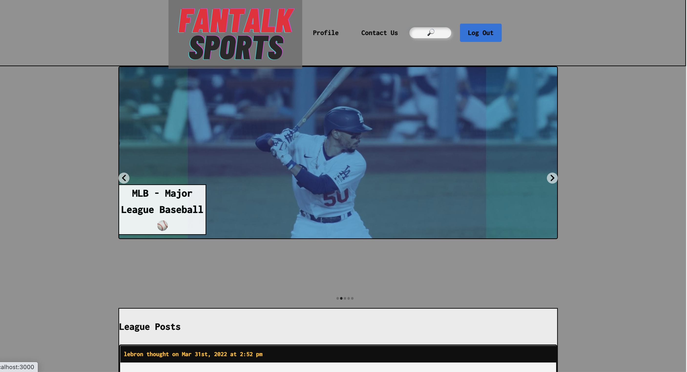

# Fantalk Sports

Created a sports forum of your favorite leagues, where you can interact and socialize with other fans and simply debate, share news, or just talk your trash!

Our goal is a simplistic form of communication strictly sports. No more signing up for multiple forums to be able to talk about your favorite sport and teams.

Wanted to create an app where users can just simply make an account and join a “League” to discuss sports, as well jump from League to League without opening up another app.

## Table of Contents
- [Live Site](#live-site)
- [Preview](#preview)
- [Tech Used](#tech-used)
- [Installation](#installation)
- [Usage](#usage)

### Live Site
https://fantalksports.herokuapp.com/

### Tech used
HTML, CSS, JavaScript, Mongodb, GraphQL, Node, React

### Preview 

## Installation 

To install this project into your own, use `git clone <REPONAME>` in your command-line, then `npm init` to install the listed dependencies.

## Usage 

To use this repo, go to the cloned files, then type `npm run develop` in your command-line. Be sure you’re in the correct location in your command-line/terminal(ROOT!) first! Be sure you're also set up to run a react app!
preview

## Questions 
Project By Julienne Garcia, Marcos Sotelo, Daniel Stephen

